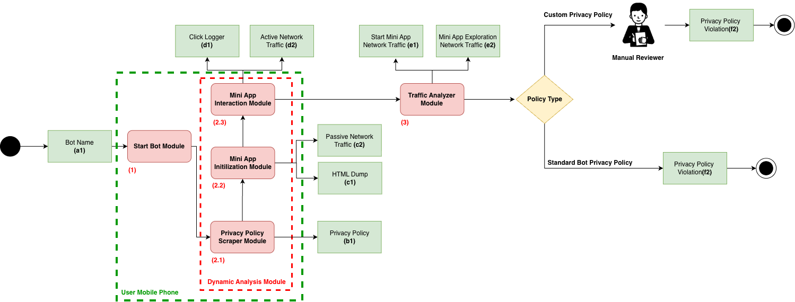

# TeleGapper

[](https://arxiv.org/abs/2608.13390)

## Citation

If you use TeleGapper in your research, please cite our paper:

```bibtex
@misc{ferrari2026telegapperunreliabilityprivacypolicies,
      title={TeleGapper: On the (un)reliability of Privacy Policies in Telegram Mini apps}, 
      author={Luca Ferrari and Mariano Ceccato and Luca Verderame},
      year={2026},
      eprint={2608.13390},
      archivePrefix={arXiv},
      primaryClass={cs.CR},
      url={https://arxiv.org/abs/2608.13390}, 
}
```

**TeleGapper** is a black-box dynamic analysis tool for Telegram Mini Apps on Android devices.

It drives Telegram with Appium, opens a target bot, starts the Mini App, dumps UI/HTML, copies proxy traffic, and builds a JSON report with extracted sensitive-data indicators.

## Methodology



Given a bot name **(a1)**, the *Start Bot Module* **(1)** opens the chat on the user's
Android device. The *Dynamic Analysis Module* **(2)** then runs three stages on the
device: the *Privacy Policy Scraper* **(2.1)** collects the declared policy **(b1)**,
the *Mini App Initialization Module* **(2.2)** launches the Mini App and captures the
HTML dump **(c1)** and passive network traffic **(c2)**, and the *Mini App Interaction
Module* **(2.3)** drives the UI while recording the click log **(d1)** and the active
network traffic **(d2)**.

The *Traffic Analyzer Module* **(3)** splits the captured traffic into start-up **(e1)**
and exploration **(e2)** phases and matches the observed data flows against the policy.
Apps with a standard bot privacy policy are flagged automatically **(f2)**; apps with a
custom policy go to a manual reviewer before the violation verdict is issued.

## Features

- Automated Telegram navigation (`@bot` search, chat open, Mini App launch)
- Native + WebView extraction flow
- XML UI dump and HTML source dump
- Per-bot traffic copy from Burp log
- Traffic analysis report (`scripts/TrafficAnalysis.py`)
- Privacy keyword checks on HTML/XML output

## Repository Layout

- `Automator.py`: main entry point
- `ScraperMiniApp/scraper.py`: Selenium scraper for `https://tapps.center/`
- `ScraperMiniApp/botList.txt`: list of Telegram bots used by batch flows
- `scripts/DynamicAnalysis.py`: Appium flow + extraction pipeline
- `scripts/Util.py`: filesystem, WebView/debug helpers, keyword scan
- `scripts/ProxySetUp.py`: Burp log reset/copy utilities
- `scripts/TrafficAnalysis.py`: traffic parser and report generator
- `script.sh`: batch execution over `ScraperMiniApp/botList.txt`
- `Analysis results/`: generated artifacts (xml/html/traffic/res)
- `Dockerfile`, `docker-compose.yml`, `docker/`: containerized pipeline

## Docker

TeleGapper can run in a container while Appium, the adb server and Burp stay on
the host (the Android device is on USB, which Docker Desktop cannot pass through):

```bash
cp .env.example .env          # set the device serial and chromedriver paths
docker compose build

# on the host, once per session
adb kill-server && adb -a -P 5037 nodaemon server &
appium --address 0.0.0.0 --allow-insecure uiautomator2:chromedriver_autodownload

docker compose run --rm pipeline                                # batch
docker compose run --rm pipeline python Automator.py @wallet    # single bot
docker compose run --rm scraper                                 # tapps catalog
```

See [docker/README-docker.md](docker/README-docker.md) for the full rationale and
troubleshooting.

## Prerequisites

- Python `3.10+`
- Android device with Telegram installed and logged in (**Battery usage for Telegram MUST be set to Unrestricted** to prevent the system from aggressively killing it)
- `adb` available in PATH and USB debugging enabled
- Appium server running (default `http://127.0.0.1:4723`)
- Matching Chromedriver binaries for Telegram WebView
- Burp Suite logging to a text file (recommended for traffic analysis)

## Setup

1. Create and activate a virtual environment:

```bash
python3 -m venv venv
source venv/bin/activate
```

2. Install dependencies:

```bash
pip install -r requirements.txt
```

3. Configure `.env` (start from `.env.example`):

```env
APPIUM_SERVER_URL="http://127.0.0.1:4723"
APPS_DIR="/absolute/path/to/TeleGapper/Analysis results"
BURP_LOG_FILE="/absolute/path/to/TeleGapper/burp_log.txt"
BURP_CONFIG_FILE="/absolute/path/to/TeleGapper/proxy_config.json"
BURP_PROXY_IP="192.168.x.x:8080"
```

All path settings are resolved to absolute paths at import time: an absolute
value is used as is, and a relative one is anchored at the repository root
(never at the current working directory), so a run started from any directory
reads and writes the same files. Leaving a path unset falls back to the
repository-root default (`Analysis results/`, `appium_server.log`).

4. Set the device capabilities in `.env` (they are no longer hardcoded in
   `scripts/DynamicAnalysis.py`):

```env
ANDROID_DEVICE_NAME="<adb devices serial>"   # empty = let Appium pick the only device
ANDROID_PLATFORM_VERSION="16"
CHROMEDRIVER_DIR="/absolute/path/to/chromedrivers"
CHROMEDRIVER_MAPPING_FILE="/absolute/path/to/chromedriver_mapping.json"
```

5. Create screenshot output directory if missing:

```bash
mkdir -p "Analysis results/screenshot"
```

## Burp Logging (One-Time)

Configure Burp to continuously log Proxy requests/responses to the same file used in `BURP_LOG_FILE`.

The run flow clears that file at startup and then copies it to `Analysis results/traffic/@<bot>_traffic.txt` at the end.

## Usage

1. Start Appium:

```bash
appium --allow-insecure uiautomator2:chromedriver_autodownload
```

2. Run a single bot:

```bash
python Automator.py @DetectivePuzzlesBot
```

3. Run batch mode from `ScraperMiniApp/botList.txt`:

```bash
bash ./script.sh
```

4. Run the Tapps catalog scraper:

```bash
python ScraperMiniApp/scraper.py
```

## Output

- `Analysis results/xml/<slug>_ui_dump.xml`
- `Analysis results/html/<slug>_mini_app.html`
- `Analysis results/traffic/@<bot>_traffic.txt`
- `Analysis results/res/*_report.json` (traffic findings + privacy checks)
- `tapps_apps_live.csv` (generated by `ScraperMiniApp/scraper.py` at the repository root, or at `TAPPS_CSV` if set)

## Notes

- `Automator.py` expects one positional argument: bot username (for example `@wallet`).
- WebView debug is enabled via `adb shell setprop debug.chromium.webview_debug true`.
- The current workflow reboots the device at the end of each run (`adb reboot` in `reboot_device()`).
- The Tapps scraper uses Selenium 4 driver management by default and optionally `webdriver-manager` if installed.
- **Note on Scraper Mini App**: The scraper was functional until June 2026. The interface of the scraped site was changed in August 2026. However, the site can still be found on the snapshot from June 6, 2026, on the [Wayback Machine - Internet Archive](https://web.archive.org/web/20260606072458/https://tapps.center/).
